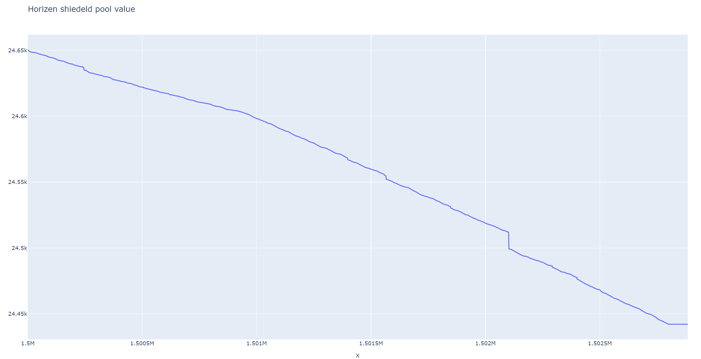

# Zen Shielded Pool Chart

This is a very simple Python script meant to retrieve and show data related to the [Horizen blockchain](https://github.com/HorizenOfficial/zen).

In particular, it plots the evolution of the shielded transaction pool in terms of total shielded amount for any block height.

**Example of chart made with [Matplotlib](https://github.com/matplotlib/matplotlib) (default)**


**Example of chart made with [Plotly](https://github.com/plotly/plotly.py)**


## Configuration

The script works under the following assumptions:
- A Zen node (Zend) is available locally (127.0.0.1) and exposes the RPC interfaces on port 8231 (default one for Mainnet)
- The RPC interface of such node is protected using username `dummy_user` and password `dummy_password`
- The file `mainnet_shielded_pool.csv` is available in the project root folder

If any assumption above is wrong, you need to manually change the hardcoded constants inside `main.py`.

## Compatibility

The script is expected to work properly with any recent Python version, but it has been tested with Python `3.11.1` only.

## Usage

```bash
# Clone the repo ...
git clone git@github.com:ptagl/zen-pool-chart.git
cd zen-pool-chart
# Install dependencies with pip
pip install -r requirements.txt
# Extract the CSV data
lzma -dk mainnet_shielded_pool.csv.lzma
# Run the synchronization with Zend and then plot
python main.py
```

> Note: extracting and using `mainnet_shielded_pool.csv` is optional and meant only to simplify the usage of the script.
  In case you don't trust the source, you can delete/rename the CSV file and retrieve data from scratch (but it requires quite some time).

To update CSV data by querying the Zend node and plot the chart from the genesis block:

```bash
python main.py
```

To update CSV data and plot from a given starting height:

```bash
python main.py --plot_from_height 1450100
```

To plot using Plotly instead of Matplotlib:

```bash
python main.py --experimental
```

> Note: using Plotly is not recommended when plotting too many data points due to performance issues.

To plot without updating the CSV file first:

```bash
python main.py --no_update
```

To verify the consistency of the CSV file:
```bash
python main.py --verify_data
```

